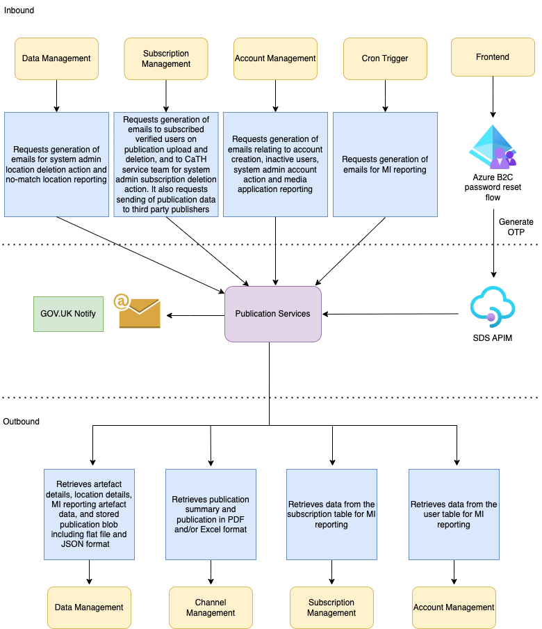

# pip-publication-services

## Table of Contents

- [Overview](#overview)
- [Features and Functionality](#features-and-functionality)
  - [GOV.UK Notify](#gov-uk-notify)
  - [Subscription Fulfillment](#subscription-fulfillment)
  - [Third Party Publisher](#third-party-publisher)
- [Roles](#roles)
- [Architecture Diagram](#architecture-diagram)
- [Getting Started](#getting-started)
  - [Prerequisites](#prerequisites)
    - [General](#general)
    - [Local development](#local-development)
    - [Nice-to-haves](#nice-to-haves)
  - [Installation](#installation)
  - [Configuration](#configuration)
    - [Environment variables](#environment-variables)
      - [Getting all environment variables with python](#get-environment-variables-with-python-scripts)
      - [Additional test secrets](#additional-test-secrets)
      - [Application.yaml files](#applicationyaml-files)
- [API Documentation](#api-documentation)
- [Deployment](#deployment)
- [Monitoring and Logging](#monitoring-and-logging)
  - [Application Insights](#application-insights)
- [Security & Quality Considerations](#security--quality-considerations)
- [Test Suite](#test-suite)
  - [Unit tests](#unit-tests)
  - [Functional tests](#functional-tests)
- [Contributing](#contributing)
- [License](#license)


## Overview

`pip-publication-services` is a microservice that deals with operations related to sending of notification emails to verified users, admin users and publication subscribers using GOV.UK Notify, as well as forwarding of publications to third-party publishers.

It sits within the Court and Tribunal Hearings Service (CaTH hereafter), written with Spring Boot/Java.

In practice, the service is usually containerized within a hosted kubernetes environment within Azure.

All interactions with `pip-publication-services` are performed through the API (specified in [API Documentation](#api-documentation)) either as a standalone service or via connections to other microservices.

## Features and Functionality

- Generation of the following email contents using the emails templates stored in GOV.UK Notify:
  - Welcome emails relating to the creation of new and existing verified and admin user accounts, as well as duplicate media accounts.
  - Emails to inactive verified, admin and HMCTS IdAM users, requesting them to verify or sign in to their accounts.
  - Subscription related emails to verified users when new publications are uploaded to CaTH, or when a user’s subscriptions are being deleted as a result of routine maintenance of locations within CaTH.
  - Notification emails to all system admin users when selected audit actions are performed by other system admins.
  - CaTH service team emails containing reports of current data contents and statistics, and when a publication is being uploaded with an unindentified location.
- Handles forwarding of newly uploaded publications to third party publishers.
- Secure/Insecure Mode: Use of bearer tokens for authentication with the secure instance (if desired).
- OpenAPI Spec/Swagger-UI: Documents and allows users or developers to access API resources within the browser.

### GOV.UK Notify

[GOV.UK Notify](https://www.notifications.service.gov.uk/) allows government departments to send emails, text messages and letters to their users. To use this Notify service, you will first need to create an account on its website, if you don't have one. You will also need to request access from a member of the CaTH team in order to view/edit the information on the GOV.UK Notify CaTH account. The CaTH team member will need to log in to GOV.UK Notify to invite you to join and configure your access policies according to your roles.

`pip-publication-services` integrates with the java client libraries for GOV.UK Notify by means of an API key. The API keys are stored in Microsoft Azure key vaults which can be accessed from the [Azure portal](https://portal.azure.com/) with relevant permissions and subscriptions. There are 2 API keys configured for CaTH:
- `gov-uk-notify-api-key` - Live key for sending of official CaTH emails.
- `gov-uk-notify-team-key` - Key to be used by the CaTH team for local development or on non-prod environments.
- `gov-uk-notify-test-api-key` - Test key with limited allowances to use for testing and local development.

To use the GOV.UK Notify email sending service, reusable email templates need to be pre-configured on the CaTH account using its website. The email templates have some placeholder fields which will be replaced with the actual contents generated by `pip-publication-services`. The PIP service uses the unique ID associated with an email template to identify and link to the individual template on GOV.UK Notify. The placeholder values are set dynamically by CaTH when a email is requested and sent to the Notify service together with the intended recipient email addresses. The replacement of placeholders and the actual sending of the emails are handled by GOV.UK Notify.

For any update to GOV.UK Notify e-mail template such as adding new fields or changes to existing placeholders, we should first create a copy of the existing template and make the relevant changes in the new copy. We then update the code in the service to point to this new template for local testing. Once the changes have been verified and deployed, we can make changes to the main template and point the code back to the original template.

### Subscription Fulfillment

CaTH verified users are able to add email subscriptions to new publications using either the court name, case reference number, case name or case URN. When a publication matching the users' subscriptions are uploaded to CaTH, they will receive an email notification telling them the publication is available to view from the CaTH frontend.

`pip-publication-services` fulfills the subscription with the following process:
- When a new publication is uploaded, `pip-subscription-management` determines all the subscribers to that publication and notify `pip-publication-services`, passing in all the subscribers' emails alongside the publication unique reference ID.
- `pip-publication-services` then retrieves the publication metadata from `pip-data-management` and determine whether the publication has been uploaded as a flat file or in JSON format.
- If the publication was uploaded as a flat file, it will retrieve the uploaded file from Azure blob storage through `pip-data-management`.
- If the publication was uploaded in JSON format, it will retrieve the stored publication summary information and the files in alternative publishing formats (PDF and/or Excel spreadsheet) through `pip-channel-management`. These files/summary are pre-generated and stored in Azure blob storage during the upload process.
- The email will be personalised using the information above by means by placeholders. Any required files will be uploaded to GOV.UK Notify and links to download the files will be provided in the emails.
- All the required email information will be sent to GOV.UK Notify to generate the emails for the subscribers.

### Third Party Publisher

When a new publication is uploaded to CaTH, `pip-subscription-management` retrieves all the third party publishers for that publication through `pip-channel-management`. The allowed third party users (also known as `channel`) for that publication is determined using the user roles in relation to the list type being published (can be press, CFT or crime lists). It will then notify `pip-publication-services`, passing in the Artefact ID and the third party API destination, so the publication can be sent to its destination.

Currently [Courtel](https://www.courtserve.net/) is the only third party publisher configured for CaTH but the service is able to send publications to multiple third party channels if we have more publishers.

If the publication was uploaded as a flat file, the same file will be retrieved from Azure blob storage through `pip-data-management`, and forwarded to Courtel in multipart/form-data format.

If the publication was uploaded in JSON format, the original content will be sent to Courtel in JSON format. The service will also retrieve the stored PDF from Azure blob storage through `pip-channel-management`, and make a second call to the Courtel API attaching the PDF in multipart/form-data format.

Courtel will also be notified if publications sent to them have been deleted by CaTH.

## Roles

Any endpoint that should require authentication, needs to be annotated either at controller or endpoint level with @IsAdmin.

## Architecture Diagram



## Getting Started

### Prerequisites

##### General

- [Java JDK 17](https://openjdk.org/projects/jdk/17/) - this is used throughout all of our services.
- REST client of some description (e.g. [Curl](https://github.com/curl/curl), [Insomnia](https://insomnia.rest/), [Postman](https://www.postman.com/)). Swagger-UI can also be used to send requests.

##### Local development

- [Azurite](https://learn.microsoft.com/en-us/azure/storage/common/storage-use-azurite) - Local Azure emulator used along with Azure Storage explorer for local storage.
- [Azure Storage Explorer](https://azure.microsoft.com/en-us/products/storage/storage-explorer) - Used for viewing and storing blobs within an Azurite instance locally.

##### Nice-to-haves

- [pip-dev-env](https://github.com/hmcts/pip-dev-env) - This repo provides a development environment wherein ensure all microservices, as well as external services (e.g. postgres & redis) are all running in tandem within the service. It eases the development process and is particularly helpful when working with cross-service communication, as it also reduces strain on local performance from having many separate IDE windows open.

### Installation

- Clone the repository
- Ensure all required [environment variables](#environment-variables) have been set.
- Build using the command `./gradlew clean build`
- Start the service using the command `./gradlew bootrun` in the newly created directory.

### Configuration

#### Environment Variables

Environment variables are used by the service to control its behaviour in various ways.

These variables can be found within various separate CaTH Azure keyvaults. You may need to obtain access to this via a support ticket.
- Runtime secrets are stored in `pip-ss-{env}-kv` (where {env} is the environment where the given instance is running (e.g. production, staging, test, sandbox)).
- Test secrets are stored in `pip-bootstrap-{env}-kv` with the same convention.

##### Get environment variables with python scripts
Python scripts to quickly grab all environment variables (subject to Azure permissions) are available for both [runtime](https://github.com/hmcts/pip-dev-env/blob/master/get_envs.py) and [test](https://github.com/hmcts/pip-secret-grabber/blob/master/main.py) secrets.

##### Runtime secrets

Below is a table of currently used environment variables for starting the service, along with a descriptor of their purpose and whether they are optional or required.

| Variable                           | Description                                                                                                                                                                                                                                                      | Required? |
|:-----------------------------------|:-----------------------------------------------------------------------------------------------------------------------------------------------------------------------------------------------------------------------------------------------------------------|-----------|
| SPRING_PROFILES_ACTIVE             | If set to `dev`, the application will run in insecure mode (i.e. no bearer token authentication required for incoming requests.) *Note - if you wish to communicate with other services, you will need to set them all to run in insecure mode in the same way.* | No        |
| APP_URI                            | Uniform Resource Identifier - the location where the application expects to receive bearer tokens after a successful authentication process. The application then validates received bearer tokens using the AUD parameter in the token                          | No        |
| CLIENT_ID                          | Unique ID for the application within Azure AD. Used to identify the application during authentication.                                                                                                                                                           | No        |
| TENANT_ID                          | Directory unique ID assigned to our Azure AD tenant. Represents the organisation that owns and manages the Azure AD instance.                                                                                                                                    | No        |
| CLIENT_SECRET                      | Secret key for authentication requests to the service.                                                                                                                                                                                                           | No        |
| ACCOUNT_MANAGEMENT_URL             | URL used for connecting to the pip-account-management service. Defaults to staging if not provided.                                                                                                                                                              | No        |
| DATA_MANAGEMENT_URL                | URL used for connecting to the pip-data-management service. Defaults to staging if not provided.                                                                                                                                                                 | No        |
| CHANNEL_MANAGEMENT_URL             | URL used for connecting to the pip-channel-management service. Defaults to staging if not provided.                                                                                                                                                              | No        |
| SUBSCRIPTION_MANAGEMENT_URL        | URL used for connecting to the pip-subscription-management service. Defaults to staging if not provided.                                                                                                                                                         | No        |
| ACCOUNT_MANAGEMENT_AZ_API          | Used as part of the `scope` parameter when requesting a token from Azure. Used for service-to-service communication with the pip-account management service.                                                                                                     | No        |
| DATA_MANAGEMENT_AZ_API             | Used as part of the `scope` parameter when requesting a token from Azure. Used for service-to-service communication with the pip-data-management service.                                                                                                        | No        |
| CHANNEL_MANAGEMENT_AZ_API          | Used as part of the `scope` parameter when requesting a token from Azure. Used for service-to-service communication with the pip-channel management service.                                                                                                     | No        |
| SUBSCRIPTION_MANAGEMENT_AZ_API     | Used as part of the `scope` parameter when requesting a token from Azure. Used for service-to-service communication with the pip-subscription-management service.                                                                                                | No        |
| NOTIFY_API_KEY                     | Used in the authorisation header for interaction with GOV.UK notify client. The API key follows the format {key_name}-{iss-uuid}-{secret-key-uuid}. When running the service locally we should not use the live key. Only test or team API key should be used.   | Yes       |
| PI_TEAM_EMAIL                      | The email address for sending CaTH reporting emails (e.g. media applications, mi reports, unindentified blobs) to.                                                                                                                                               | No        |
| THIRD_PARTY_CERTIFICATE            | A trust store containing certification for Courtel as the trusted third party publisher.                                                                                                                                                                         | No        |

##### Additional Test secrets

Secrets required for getting integration tests to run correctly can be found in the below table:

| Variable                       | Description                                                                    |
|:-------------------------------|:-------------------------------------------------------------------------------|
| CLIENT_ID                      | As above                                                                       |
| CLIENT_SECRET                  | As above                                                                       |
| APP_URI                        | As above                                                                       |
| TENANT_ID                      | As above                                                                       |
| ACCOUNT_MANAGEMENT_AZ_API      | As above                                                                       |
| DATA_MANAGEMENT_AZ_API         | As above                                                                       |
| CHANNEL_MANAGEMENT_AZ_API      | As above                                                                       |
| SUBSCRIPTION_MANAGEMENT_AZ_API | As above                                                                       |
| NOTIFY_API_KEY                 | As above. Only the test API key should be used when running integration tests. |
| PI_TEAM_EMAIL                  | As above                                                                       |

#### Application.yaml files
The service can also be adapted using the yaml files found in the following locations:
- [src/main/resources/application.yaml](./src/main/resources/application.yaml) for changes to the behaviour of the service itself.
- [src/main/resources/application-dev.yaml](./src/main/resources/application-dev.yaml) for changes to the behaviour of the service when running locally.
- [src/test/resources/application-test.yaml](./src/test/resources/application-test.yaml) for changes to other test types (e.g. unit tests).

## API Documentation
Our full API specification can be found within our Swagger-UI page.
It can be accessed locally by starting the service and going to [http://localhost:8081/swagger-ui/swagger-ui/index.html](http://localhost:8081/swagger-ui/swagger-ui/index.html)
Alternatively, if you're on our VPN, you can access the swagger endpoint at our staging URL (ask a teammate to give you this).

## Examples
As mentioned, the full api documentation can be found within swagger-ui, but some of the most common operations are highlighted below.

Most of the communication with this service benefits from using secure authentication. While possible to stand up locally in insecure mode, to simulate a production environment it is better to use secure mode.
Before sending in any requests to the service, you'll need to obtain a bearer token using the following approach:

### Requesting a bearer token
To request a bearer token, send a POST request following this template:
```
curl --request POST \
  --url https://login.microsoftonline.com/{TENANT_ID}/oauth2/v2.0/token \
  --header 'Content-Type: multipart/form-data' \
  --form client_id={CLIENT_ID_FOR_ANOTHER_SERVICE} \
  --form scope={APP_URI}/.default \
  --form client_secret={CLIENT_SECRET_FOR_ANOTHER_SERVICE}\
  --form grant_type=client_credentials
```
You can copy the above curl command into either Postman or Insomnia, and they will automatically be converted to the relevant formats for those programs.

*Note - the `_FOR_ANOTHER_SERVICE` variables need to be extracted from another registered microservice within the broader CaTH umbrella (e.g. [pip-data-management](https://github.com/hmcts/pip-data-management))*

### Using the bearer token
You can use the bearer token in the Authorization header when making requests. Here is an example using an endpoint to send publication to third party publisher.
```
curl --request POST \
  --url http://localhost:8081/notify/api \
  --header 'Authorization: Bearer {BEARER_TOKEN_HERE}' \
  --header 'Content-Type: application/json' \
  --data-raw '[
    {
    	"apiDestination": "<thirdPartyUrl>",
    	"artefactId": "3fa85f64-5717-4562-b3fc-2c963f66afa6"
    }
  ]'
```

## Deployment
We use [Jenkins](https://www.jenkins.io/) as our CI/CD system. The deployment of this can be controlled within our application logic using the various `Jenkinsfile`-prepended files within the root directory of the repository.

Our builds run against our `dev` environment during the Jenkins build process. As this is a microservice, the build process involves standing up the service in a docker container in a Kubernetes cluster with the current staging master copies of the other interconnected microservices.

If your debugging leads you to conclude that you need to implement a pipeline fix, this can be done in the [CNP Jenkins repo](https://github.com/hmcts/cnp-jenkins-library)

## Monitoring and Logging
We utilise [Azure Application Insights](https://learn.microsoft.com/en-us/azure/azure-monitor/app/app-insights-overview) to store our logs. Ask a teammate for the specific resource in Azure to access these.
Locally, we use [Log4j](https://logging.apache.org/log4j/2.x/).

In addition, this service is also monitored in production and staging environments by [Dynatrace](https://www.dynatrace.com/). The URL for viewing our specific Dynatrace instance can be had by asking a team member.

### Application Insights

Application insights is configured via the lib/applicationinsights.json file. Alongside this, the Dockerfile is configured to copy in this file and also download the app insights client.

The client at runtime is attached as a javaagent, which allows it to send the logging to app insights.

To connect to app insights a connection string is used. This is configured to read from the KV Secret mounted inside the pod.

It is possible to connect to app insights locally, although somewhat tricky. The easiest way is to get the connection string from azure, set it as an environment variable (APPLICATIONINSIGHTS_CONNECTION_STRING), and add in the javaagent as VM argument. You will also need to remove / comment out the connection string line the config.
## Security & Quality Considerations
We use a few automated tools to ensure quality and security within the service. A few examples can be found below:

- SonarCloud - provides automated code analysis, finding vulnerabilities, bugs and code smells. Quality gates ensure that test coverage, code style and security are maintained where possible.
- DependencyCheckAggregate - Ensures that dependencies are kept up to date and that those with known security vulnerabilities (based on the [National Vulnerability Database(NVD)](https://nvd.nist.gov/)) are flagged to developers for mitigation or suppression.
- JaCoCo Test Coverage - Produces code coverage metrics which allows developers to determine which lines of code are covered (or not) by unit testing. This also makes up one of SonarCloud's quality gates.
- PMD - Static code analysis tool providing code quality guidance and identifying potential issues relating to coding standards, performance or security.
- CheckStyle - Enforces coding standards and conventions such as formatting, naming conventions and structure.

## Test Suite

This microservice is comprehensively tested using both unit and functional tests.

### Unit tests

Unit tests can be run on demand using `./gradlew test`.

### Functional tests

Functional tests can be run using `./gradlew functional`

For our functional tests, we are using Square's [MockWebServer](https://github.com/square/okhttp/tree/master/mockwebserver) library. This allows us to test the full HTTP stack for our service-to-service interactions.

The functional tests also call out to Data Management in staging to retrieve publications.

## Contributing
We are happy to accept third-party contributions. See [.github/CONTRIBUTING.md](./.github/CONTRIBUTING.md) for more details.

## License
This project is licensed under the MIT License - see the [LICENSE](./LICENSE) file for details.
